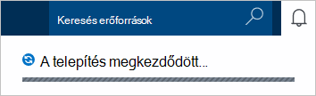

1.  Jelentkezzen be az [Azure-portálon](https://portal.azure.com/).
2.  A Jumpbar, a kattintson az **Új** **adatok + tárhely**kattintson, és válassza a **DocumentDB (NoSQL)**.

      

3. Az **Új fiók** lap adja meg a kívánt konfiguráció DocumentDB fiók.

    

    - Az **azonosító** mezőbe írja be egy nevet, amely azonosítja a DocumentDB fiókot.  Amikor **azonosító** érvényesítése, zöld pipa jelzi megjelenik az **azonosító** mezőbe. Az **azonosító** értéke az állomásnév belül a URI lesz. Az **azonosító** tartalmazhat csak a kisbetűket, számok, és a "-" karakter, és a 3 és 50 karakter közé kell lennie. Figyelje meg, hogy *documents.azure.com* van ellátva, amelynek eredménye változik a DocumentDB fiók végpont lehetőséget választja, végpontjának neve.

    - A **NoSQL API** mezőben jelölje ki a **DocumentDB**.  

    - **Előfizetés**jelölje be az Azure előfizetés DocumentDB fióknak használni kívánt. Ha a fiók csak egy előfizetéssel rendelkezik, a fiók alapértelmezés szerint van jelölve.

    - **Erőforráscsoport**jelölje be, vagy hozzon létre egy erőforrás csoportot a DocumentDB fiók.  Alapértelmezés szerint új erőforráscsoport jön létre. További tudnivalókért lásd: [az Azure portálon kezelheti az Azure erőforrások](../articles/azure-portal/resource-group-portal.md).

    - **Hely** segítségével adja meg, amelyben tárolni a DocumentDB fiók földrajzi helyét. 

4.  Miután az új DocumentDB a Fiókbeállítások van beállítva, kattintson a **Létrehozás**gombra. A telepítés állapotának ellenőrzése, jelölje be az értesítések-központban.  

      

    

5.  A DocumentDB fiók létrehozását követően az alapértelmezett beállításokkal használatra kész. Az alapértelmezett konzisztencia DocumentDB fiók **munkamenet**értékre van állítva.  Beállíthatja, hogy az alapértelmezett konzisztencia az erőforrás menü **Alapértelmezett konzisztencia** gombra kattintva. További DocumentDB által kínált kapcsolatos összhangot, olvassa el a [DocumentDB konzisztencia szintjén](../articles/documentdb/documentdb-consistency-levels.md)című témakört.

      

      

[How to: Create a DocumentDB account]: #Howto
[Next steps]: #NextSteps
[documentdb-manage]:../articles/documentdb/documentdb-manage.md
