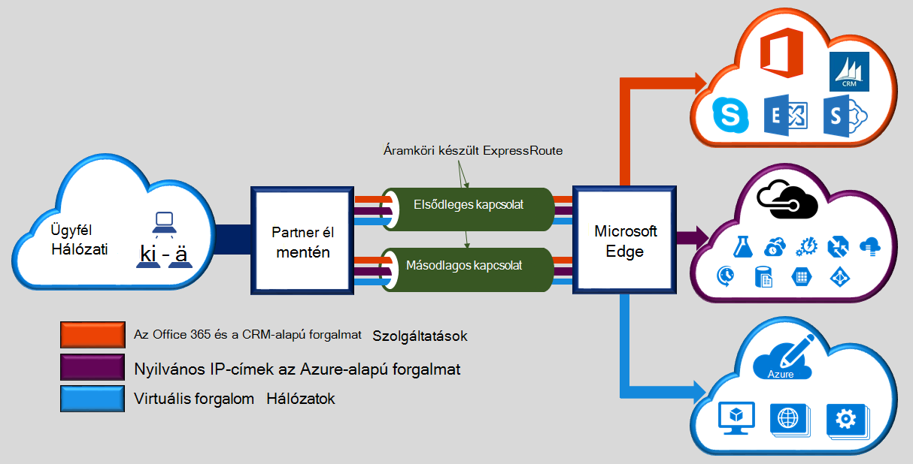

Microsoft Azure készült ExpressRoute lehetővé teszi, hogy a helyszíni hálózatok kiterjeszti a Microsoft cloud-kapcsolaton keresztül egy dedikált magánjellegű a kapcsolat szolgáltatója könnyítheti meg. Készült ExpressRoute, a Microsoft felhőszolgáltatásokhoz, például a Microsoft Azure, Office 365-ben és CRM Online kapcsolatokat hozhat létre. Kapcsolat lehet egy bármely-a-bármely (IP-VPN) hálózat, egy Ethernet pontok közötti hálózati vagy egy kapcsolatot a helymegosztást létesítmény közvetítésével virtuális határokon-kapcsolatot. Készült ExpressRoute kapcsolatok megy nyilvános interneten keresztül. Ebben a csoportban adhatja készült ExpressRoute kapcsolatok további megbízhatóság, gyorsabb sebesség, alsó késések vagy magasabb szintű biztonságos, mint a szokásos kapcsolatok kínálatát az interneten keresztül.  

